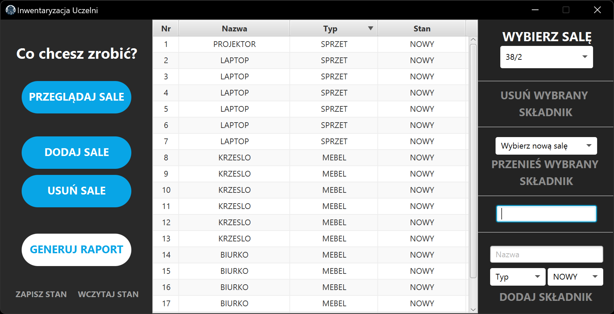

# Program do Przeprowadzania Inwentaryzacji Uczelni

Ten projekt został stworzony na potrzeby zajęć z Programowania Obiektowego na Politechnice Białostockiej.

---

Program został wykonany z użyciem następujących bibliotek:
- [JavaFx](https://openjfx.io/)
- [nfx-lib](https://github.com/xdsswar/nfx-lib)

---

## Screenshoty

1. **Pierwsze uruchomienie**


2. **Przegląd wyposażenia**


---

## Build

1. Otwórz wiersz poleceń
2. Uruchom ```mvn clean install```
3. Uruchom ```mvn clean javafx:jlink```
4. Możesz teraz uruchomić inwentarz.jar z użyciem wygenerowanego jre /target/image
