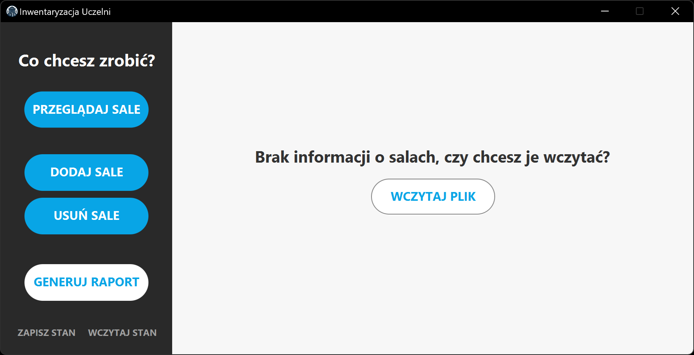

# Program do Przeprowadzania Inwentaryzacji Uczelni

Ten projekt został stworzony na potrzeby zajęć z Programowania Obiektowego na Politechnice Białostockiej.

---

Program został wykonany z użyciem następujących bibliotek:

- JavaFx
- [nfx-lib](https://github.com/xdsswar/nfx-lib)

---

